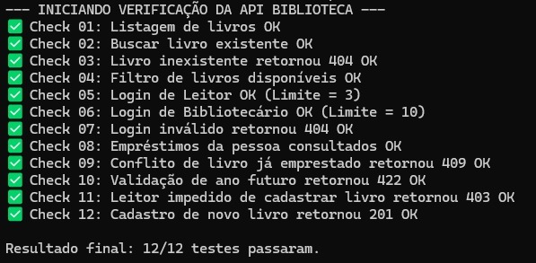
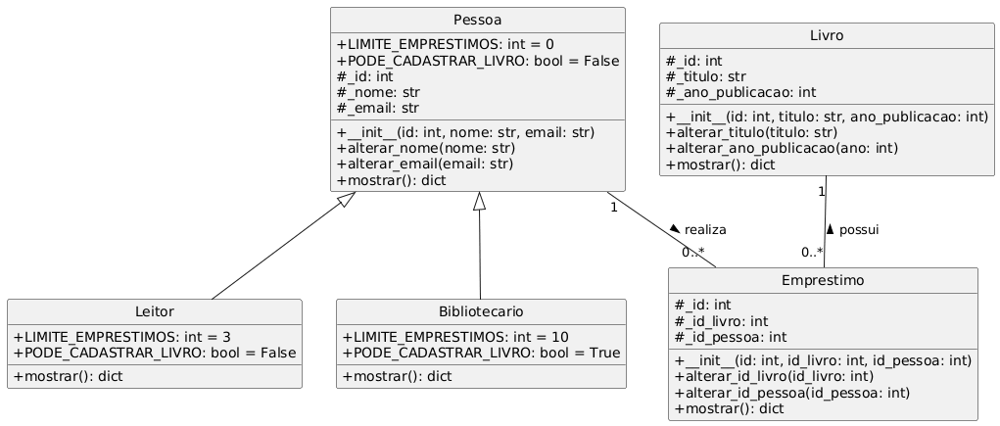

# 📚 API - Biblioteca Comunitária

Este projeto é o backend de um sistema de Biblioteca Comunitária, desenvolvido como avaliação para a disciplina de Programação Orientada a Objetos. O sistema segue uma arquitetura rígida em 4 camadas (`data`, `models`, `controllers` e `routes`), aplicando conceitos de encapsulamento, herança e polimorfismo.

<p align="center">
  
  
  
  
  
</p>

## 🚀 Como Rodar o Projeto

Para executar a API localmente, siga os passos abaixo:

1. **Clone o repositório:**
   ```bash
   git clone https://github.com/RyanSS27/api-biblioteca-comunitaria.git
   ```

2. **Acesse a pasta da API:**
   Certifique-se de entrar na subpasta onde o código-fonte está localizado:
   ```bash
   cd api-biblioteca-comunitaria/api-biblioteca
   ```

3. **Crie e ative um ambiente virtual (recomendado):**
   * No Windows:
     ```bash
     python -m venv venv
     venv\Scripts\activate
     ```
   * No Linux/Mac:
     ```bash
     python3 -m venv venv
     source venv/bin/activate
     ```

4. **Instale as dependências:**
   ```bash
   pip install -r requirements.txt
   ```

5. **Inicie o servidor local:**
   ```bash
   uvicorn main:app --reload
   ```

6. **Acesse a documentação interativa (Swagger):**
   * Abra o navegador em: [http://127.0.0.1:8000/docs](http://127.0.0.1:8000/docs)

---

## ✅ Verificação do Projeto

Para rodar os testes obrigatórios da entrega, execute o comando abaixo dentro da pasta `api-biblioteca`:

```bash
python verificar.py
```

**Saída do script de verificação:**


---

## 🏗️ Diagrama de Classes

Abaixo está o diagrama demonstrando as 3 entidades principais, a hierarquia de `Pessoa` e o vínculo feito pelo `Emprestimo`.



---

## 🌐 Tabela de Rotas

O sistema expõe 7 rotas RESTful para gerenciar o acervo e os empréstimos:

| Método | Rota | Descrição | Retorno de Sucesso | Possíveis Erros |
| :--- | :--- | :--- | :--- | :--- |
| **GET** | `/api/livros` | Lista todo o acervo de livros da biblioteca. | `200 OK` | - |
| **GET** | `/api/livros/disponiveis` | Lista apenas os livros que não estão emprestados no momento. | `200 OK` | - |
| **GET** | `/api/livros/{id}` | Busca os detalhes de um livro específico pelo seu ID. | `200 OK` | `404 Not Found` |
| **POST** | `/api/livros` | Cadastra um novo livro (requer que a pessoa logada seja Bibliotecário). | `201 Created` | `404 Not Found`, `403 Forbidden`, `422 Unprocessable Entity` |
| **POST** | `/api/login` | Simula o login recebendo um e-mail e retornando os dados e permissões do perfil. | `200 OK` | `404 Not Found` |
| **GET** | `/api/pessoas/{id}/emprestimos`| Lista todos os livros com os quais uma determinada pessoa está no momento. | `200 OK` | `404 Not Found` |
| **POST** | `/api/emprestimos` | Registra um novo empréstimo, validando limites e disponibilidade. | `201 Created` | `404 Not Found`, `409 Conflict`, `422 Unprocessable Entity` |

---

## 👥 Funções dos Membros do Grupo

- **Ryan**: Responsável por estruturar e implementar as classes com base nas regras de negócio, garantindo os devidos usos de encapsulamento, herança e polimorfismo, criando os arquivos de Mocks (`data`) para testes; 
- **Jonathan**: Desenvolveu a camada `Controllers`, garantindo a ausência de código HTTP, construindo o método genérico de serialização em dicionário e list comprehensions.
- **Marcos**: Construção da camada `Routes` com FastAPI, traduzindo os erros genéricos (ValueError) para o padrão de status de requisição web (404, 409, 422) e documentação final.
- **Giovane**: Analisou cenários de uso manuais e testes automatizados afim de validar a qualidade da entrega, tratamento devido das exceções e conformidade para com os requisitos do projeto.
---

## 📄 Licença

Este projeto está sob a licença [MIT](./LICENSE).
